Prototype can be found at https://github.com/deco3500/Team-Fruity-Tutti/tree/master/thebeacon/src
Simply open up the index.html page to launch the site.

A promotional video was created for the Beacon and can be viewed here: https://youtu.be/Rle_wsSYlnE

Documentation that has been kept on our Google Drive throughout the semester such as user testing results etc. can be found on our Github under the Prototype Testing Process folder.

##Summary:
Team Fruitti Tutti has been working on The Beacon for the past semester in DECO3500. The Beacon is an online digital news source that allows users to select a level of digital literacy and interact with friends through a pin-story social board while also solving the journalistic issue of sensationalism by only showing “good-news” stories. The key aim for the app is to make digital news engaging for the elderly (65+) as usually they are not willing to switch from traditional mediums such as TV, radio and newspapers. As our app has a socially-immersive concept, digital literacy levels and is non-sensationalist, through testing we have found that the elderly are likely to switch to this new online medium. This document aims to outline how Team Frutti Tutti created The Beacon from ideation to prototyping.

#Process
##Research

###Academic Research:
In order to understand the problem space completely, research was carried out on our target group, the elderly aged over 65. Initially we were focusing on digital literacy in elderly people and how they would rather use traditional mediums of journalism rather than entering the digital age. From this we found that approximately, only 20 percent of senior Australians own a smartphone. Senior Australians often cite a lack of confidence and knowledge as one of the main reasons for not participating online (Liberal Party of Australia, 2016). 

Just over a half of Australians aged 65 or over use the internet while the corresponding figure of those aged 15-17 is 98.6%. The big drop-off in use is between those aged 55-64 (81%) and those in the oldest age group (Theconversation.com, 2016). This infers that the elderly demographic are less likely to learn new technology or use the web to get their news. Learning becomes “optional” later in life and therefore elderly people lose the motivation to learn. This is why they have difficulty learning new technologies (Chen, 2012). 

From this research we then wanted to figure out how we could engage elderly people to use digital mediums of news. A CSIRO study found that 50 to 60 percent of Australian elderlies (living residentially) suffer from loneliness or indicate that they are lonely. The main causes of loneliness in the elderly are that they don’t have easy access to community groups, are living alone, have been widowed or even just believe that there is no one supporting them. The CSIRO also noted that one of the most effective interventions to reduce loneliness includes developing community networks by utilising existing community resources and familiar concepts(Grenade & Boldy, 2008). 

Our research direction also led us to understand that sensationalism in the news is a large issue in the elderly community. Newspapers tend to play up and dwell on stories that are of the sensationalised variety (for example, car crashes, murder, kidnapping) (“Current Problems in the Media,” 2016). A study found that elderly people avoid programs with sensational aspects (Kleemans, 2007). The issue of sensationalism may cause anxiety in the elderly generation, of which anxiety disorders at least two times more frequent than depression in the elderly (Gauthier, 2005).

###Primary Research:
After researching our problem space, we then went directly to target users to construct a concept of our target user group. Initially, as it was difficult to find lonely individuals over the age of 65, 5 middle aged to elderly participants from a local church group were used as the research demographic (Test Group A). From these meetings, personas were generated (see personas A, B & C on github). Key findings from research indicated that the group mainly got their news from traditional sources such as radio, TV and physical newspaper. It was also identified that they feel like they are being left behind with the large amount of new technology on the market and find that concepts they’re used to are comforting. For some participants, getting news from a digital source had never occurred to them. Most have some form of social interaction at church and work, however do not make the effort to socialise outside of church hours or work hours.

As well as Test Group A, we had a primary user tester called Bob (figure 1) who is 76 and specifically the type of person we envision our application will be used by (Test Group B). He spends up to two hours per day getting the news via word of mouth, TV, radio and newspaper mediums. Although he belongs to community groups such as church and the Toowoomba local radio station, he does not socialise outside those hours and gets quite lonely.

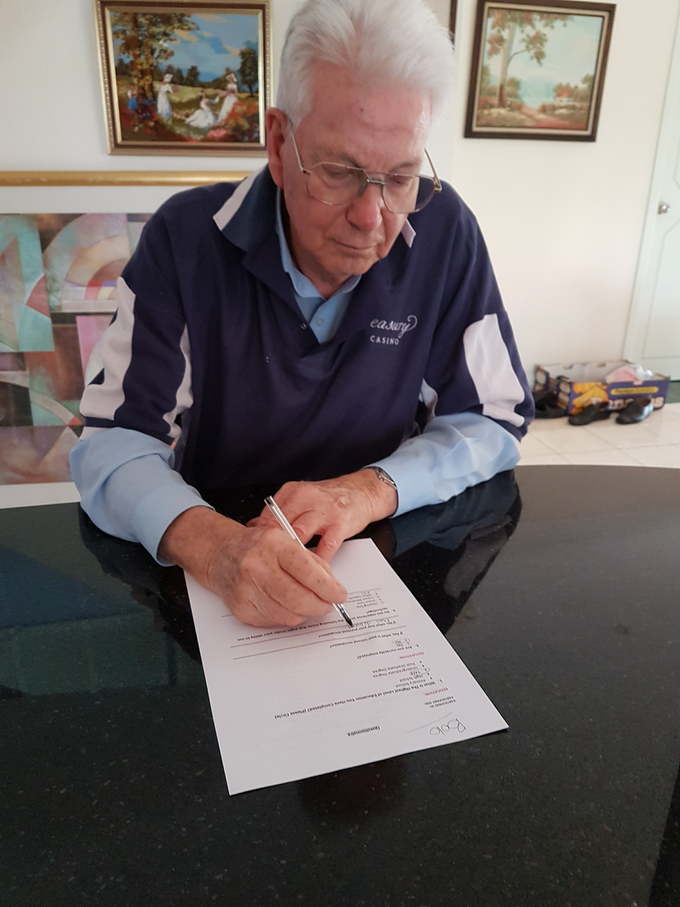

###Design Research:
Design research into the best way to engage elderly users and cater to their needs was also carried out. From the research, we found that it is difficult for older demographics to read text that is small and close. Colour vision also declines with age (difficult to distinguish between similar colours). Hearing also declines and the elderly experience hearing loss. Due to poor motor control, older people tend to have trouble hitting interface targets that aren’t clearly defined (Friedman, 2016). We will need to include solutions to these features in the final design and in order to ensure that the elderly generation can use the application, it will be tested on the target group.

##Requirements:
From our research, we have identified that elderly people, aged 65+ are unlikely to use digital mediums to get their news. Our aim will be to make digital news engaging for the elderly so that they move away from their traditional mediums and into the new technology age. In order to engage the elderly, we will address the journalistic issue of sensationalism by focusing on only showing “good news” community stories. This will ensure that the users do not get distressed or anxiety attacks from sensationalised news that is traditionally shown in TV, radio and newspaper. 

To ensure our app caters to all levels of reading and digital ability, four levels of digital literacy will be selectable. The first level will include text only, the second level will include text and image, the third level will include text, image and video and the fourth level will include text, image, video and social media. Having this wide variety of selection will ensure that the elderly users feel comfortable using the app. This will also pull on emotional design, in that they can choose a medium they’re used to (ie. text and image is similar to newspaper). 

We have also decided to focus on social isolation in the elderly as well as digital literacy and our research has highlighted that 50 to 60 percent of Australians living residentially suffer from loneliness due to living by themselves or not having much social interaction. We also found that a key intervention to reducing loneliness for the elderly includes developing community networks, which is what we were thinking of doing with our concept. We believe that this could be a core motivator in getting the elderly to engage in a digital news medium.

We have decided that to ensure our application embodies a community focus we will create a “bulletin” type of board where the users can pin stories they find interesting to. They would also be able to see stories their friends have pinned. The stories highlighted in red will represent the stories they’ve pinned and the stories highlighted blue will represent the stories from other community members.

One of the sources we found also mentioned that the most effective intervention in reducing loneliness was utilising existing community resources to make the elderly feel more comfortable and in this case that would be the bulletin board.This would also incorporate elements of emotional design.

We believe that this combination of un-sensationalised news, levels of digital literacy and a social board for pinning stories to will help ease the transition from traditional to digital news easier and make engaging in online news mediums exciting for the elderly.

To ensure our design caters to the elderly, the following design elements will be taken into consideration:
* The user interface is kept simple so that the elderly don’t get confused
* Font sizes smaller than 16 pixels are avoided
* Contrast ratios between text and background colour are considered
* Distance between key functions are considered to ensure motor control is acceptable
* The website is resizable so that it can be used on a mobile/ ipad interface or on the web

##Design Process:

Our first step in the design process, after researching our target group, was to develop personas. These personas were based off Test Group A (5 participants from local church group) as mentioned in the research portion of this document. 

We worked in four phases: 
* Phase one: Paper Prototype
* Phase two: Digital Prototype 1 (mockups)
* Phase three: Digital Prototype 2 (Web prototype)
* Phase four: Digital Prototype 3 (Web prototype iteration)

Phase one commenced and the paper prototypes were created which were based on our digital literacy concept. The initial prototype (figure 2) was developed to get an overall vision for future development and to test the usability features on our target group. The paper prototype was kept very simple so that there was room to build upon the design (see Design Prototypes folder on GitHub for all paper prototype mockups). 

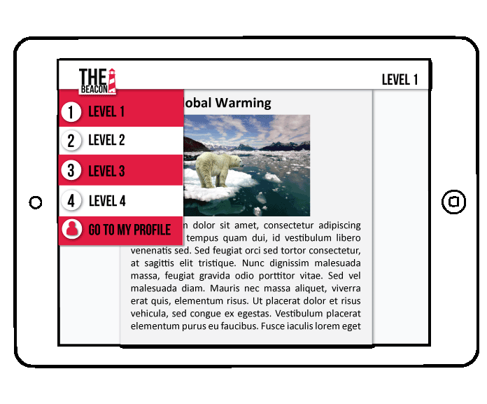

Testing was conducted on the prototype with Test Group A.  From this we were able to gauge two main findings, that the text on the prototype needed to be larger (change 12pt to 16pt) and that we should add a button that asks if the user wants to go to another page (ie. the user was clicking the wrong button which took them to the wrong page). We changed our prototype to reflect these findings. We then went back and tested on the same group (see Paper Prototyping Results on GitHub), which found that they liked the warning for leaving the page. The suggestion of a visible menu was also made as they found it difficult to visualise clicking on a hidden menu. 

In phase two, a digital prototype was created (figure 3), for the full digital prototype, please visit https://www.fluidui.com/editor/live/preview/p_QZUQVJMuQTTI53o9CmzPIiDUATbA52AT.1473765142959. This helped us understand how the elements would fit on the page, which worked well. We then needed to define what type of design style we were going to use.

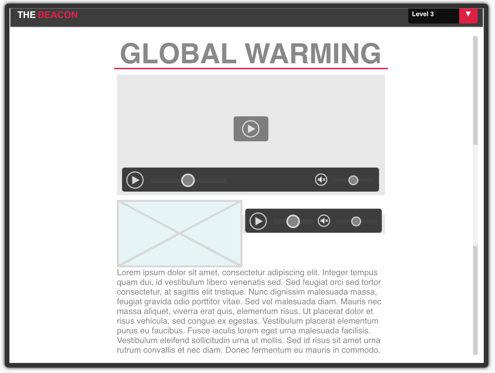

**Week 8 Standup:** At this standup, we showed the Feh and Grant our paper prototyping results. We were able to gage that we were on the right track at this point.

In order to implement a more substantial prototype, we then decided to explore how we would create the user interface. In order to do so, we created a mood board (figure 4) so that implementation would be easier (eg. colour pallet, text size, font). 

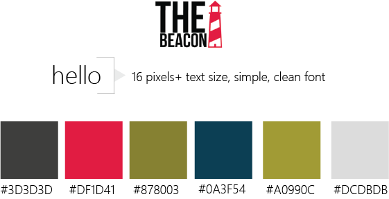

Justification behind elements on mood board:

* From our initial research we found that using very different colours in our colour pallet would allow elderly users to differentiate the different segments/ text/ content etc. Therefore we have included this array of different colours.

* The size of the text will be at least 16px to cater to readers whose vision is deteriorating.

We then started creating the interactive prototype in Phase 2. To ensure we took our prototype feedback into consideration, we changed the layout of the global navigation (figure 5). Instead of having a hidden navigation, we created a visible navigation. This was to ensure that elderly users didn’t get lost within the site and that all tabs were easily accessible and simple.

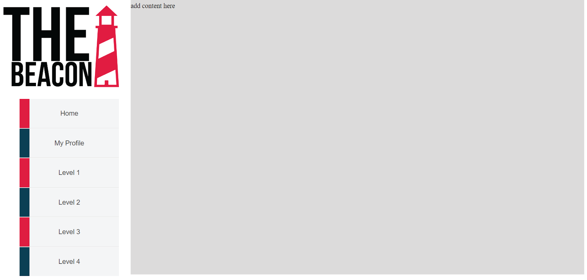

To ensure that the navigation met the target user groups technical ability, we tested this feature once again on Test Group A. Even though none of the links worked, when presented with the paper prototype and this implementation, all 5 agreed that the visible nav was the best as it was simple to click on.

We also used a contrast checker on the global navigation to ensure that the colours did not clash (all colour combos came back fine).

**Week 10 Standup/ Week 11 Feedback:** At the week 10 standup, we presented our findings and Grant also mentioned that we should try and define a social or mobile concept as ours was not meeting the brief. The next week Feh and Grant also discussed that we needed to figure out a journalistic concept. This made us think more in depth about our concept in Phase three.

In order to meet the brief, we went back to the start of the design process and conducted some more research (as described in research and requirements section) surrounding loneliness in the elderly and sensationalism in the news. We decided to incorporate these common problems into our website by engaging a social presence using the social board to combat loneliness and focusing on only good news stories to combat sensationalism. 

A mockup of the bulletin board was then created (figure 6) so that we could implement it onto the website. As there was only a short timeframe between concept change and ideation, there was no time to test this concept before the next standup/ implementation on website. 

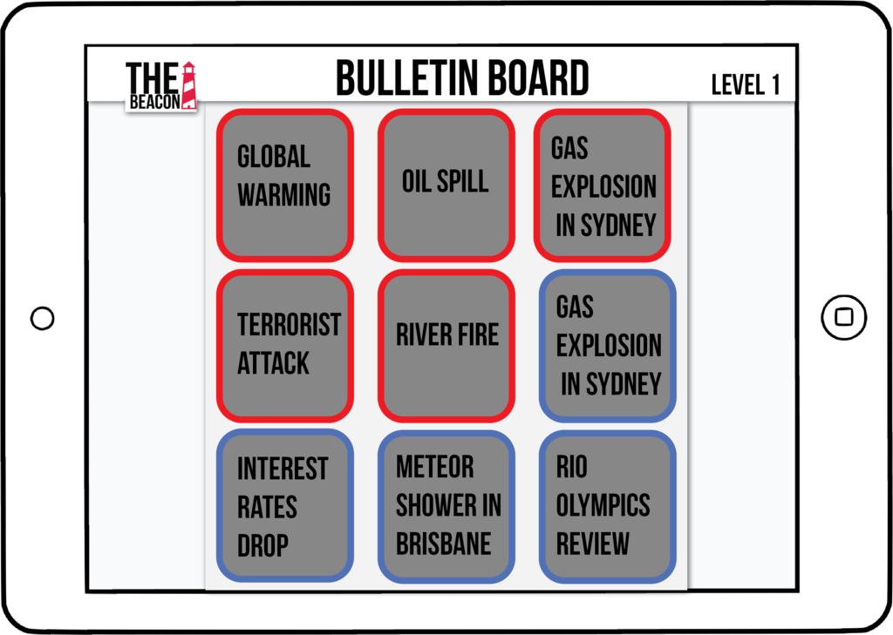

Majority of the website was then implemented so that we could get feedback at the next stand up and test the next week (figure 7). 

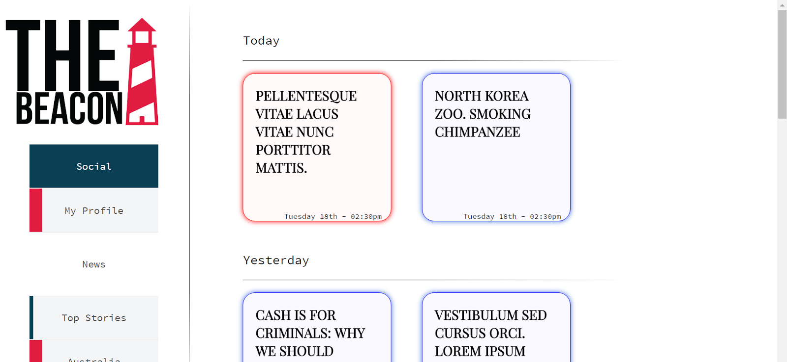

**Week 12 Standup:** Grant liked that our concept incorporated elements of the social side and a journalistic problem.

After receiving the green light, we went to test the application. For initial testing of the web application, we used Test Group B (Bob) [Figure 8].

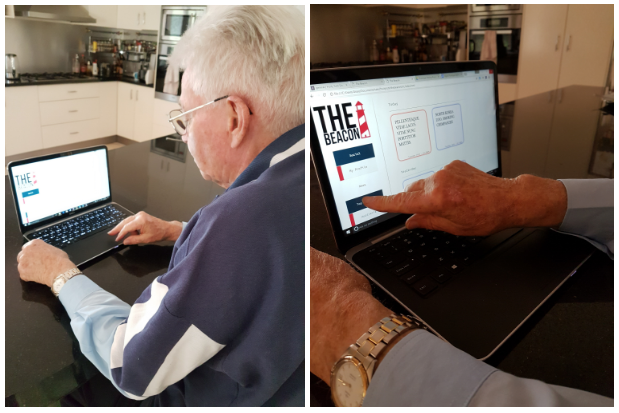

User testing with Bob found that the simplicity of the website was really comforting for older users. After learning the website and figuring out how to use it, he was able to easily access news stories and the social board. He liked that there was a social aspect and that he could see what his friends were posting. As he could clearly see all options in the global nav on the side, it was very simple for him to access the stories he wanted to read.

At the end of user testing, Bob mentioned that he would likely switch to this if he had access to an iPad. However, because he only has a computer which takes 10 minutes to boot up, it would be a better use of time just to switch on the TV or open the newspaper. One improvement he did mention, was that the site was a bit uninteresting, so suggested use of colour to make it more user friendly.

To incorporate Bob’s feedback, the site went through an entire revamp (figure 9). This also fed in nicely with our research which suggested using different contrasts of colours for those which have difficult eyesight.

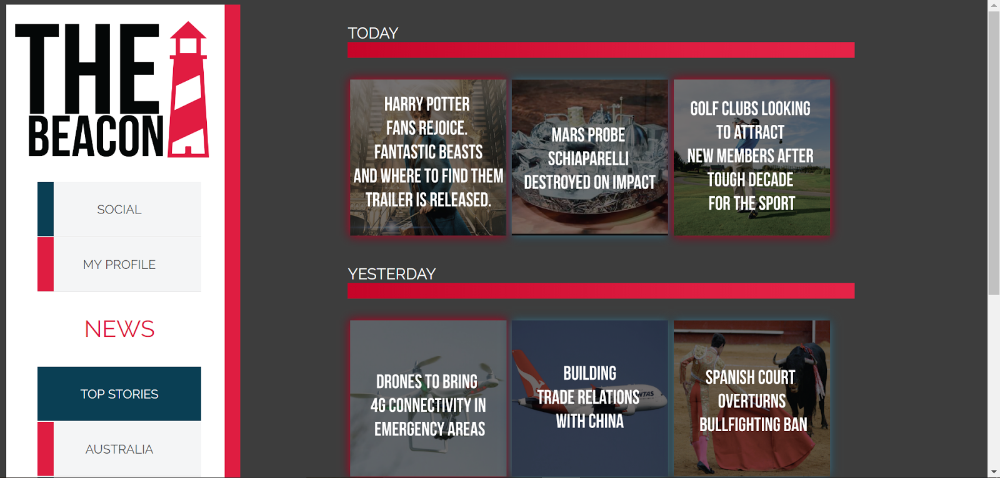

A pin was added in the right hand corner of each story so that users can pin their stories (figure 10).

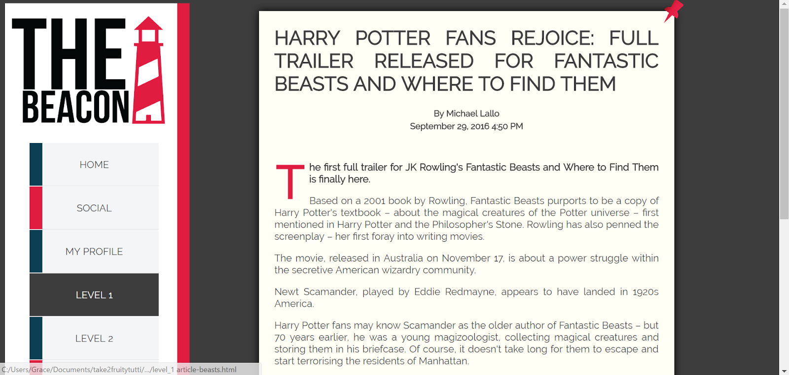

Testing was also done on two previous participants of test group A. These two users, one a graphic designer the other a systems administrator were given a set of instructions by the interviewer to perform on the site. Each interview was documented in a short video capturing the interactions on screen of each participant. (Note, volume may be a little soft).

Graphic designer age 55: 
https://drive.google.com/open?id=0B1EO0JG6Owo4eVRqN3lzcmNHNDg

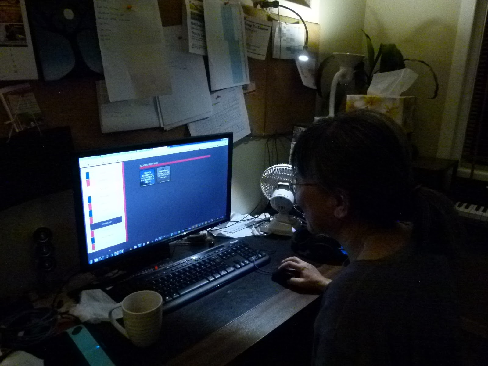

The graphic designer found that in some cases the background was too bright, which made it hard to read. The purpose of the levels was also, at first unclear but became apparent after each level had been explored.

Systems administrator age 58: 
https://drive.google.com/open?id=0B1EO0JG6Owo4Q0xPNGZtU2FMWXc

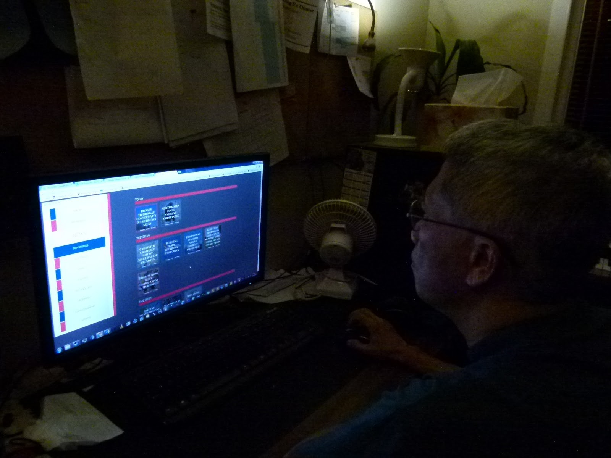

The systems admin was a little confused regarding the layout of our navigation bar, especially the home page. He also found that the screen was a bit too bright on a few of the pages, this problem however is probably due to screen brightness rather than a problem on the site. 

**Feedback Week 13:** The feedback from the tutors was to define more clearly how users see who pinned a story. To incorporate this feature, we have added a text field at the bottom to show who pinned the story.

To further incorporate a user friendliness for elderly people, we also added a button to increase and decrease the text. 

**How the Team Worked:**
In our assignment, everyone worked multi-disciplinarily however Zoe focused on design, documentation, implementation of prototype and created the video, Theodore focused on functionality and implementation of prototype, Jonas focused on testing and documentation and Grace focused on design, documentation and some testing.

References:
* Theconversation.com. (2016). [online] Available at: http://theconversation.com/australias-digital-divide-is-narrowing-but-getting-deeper-55232 [Accessed 4 Sep. 2016].
* Liberal Party of Australia. (2016). Improving the digital confidence and skills of senior Australians. [online] Available at:https://www.liberal.org.au/latest-news/2016/06/26/improving-digital-confidence-and-skills-senior-australians [Accessed 4 Sep. 2016].
* Chen, R. (2012). Why Old People Have a Hard Time Learning New Things. Retrieved August 24, 2016, from Embrace Possibility, http://www.embracepossibility.com/blog/why-old-people-have-a-hard-time-learning-new-things/
* Grenade, L., & Boldy, D. (2008, August ). Social isolation and loneliness among older people: Issues and future challenges in community and residential settings. Retrieved October 15, 2016, from CSIRO, http://www.publish.csiro.au/AH/pdf/AH080468
* Kleemans, M. (2007). Explaining Sensationalism in Television News (1st ed.). Radboud University Nijmegen.
* Gauthier, J. (2005, May). Anxiety Disorders. Retrieved October 21, 2016, from Anxiety Canada, http://www.anxietycanada.ca/english/pdf/ElderlyEn.pdf
* Current Problems in the Media. (2016, October 21). Retrieved October 21, 2016, from Daily Source, http://www.dailysource.org/about/problems#.WAqta-B942w
* Friedman, V. (2016, June 20). Designing Digital Technology for the Elderly. Retrieved September 16, 2016, from Smashing Magazine, https://www.smashingmagazine.com/2015/02/designing-digital-technology-for-the-elderly/
