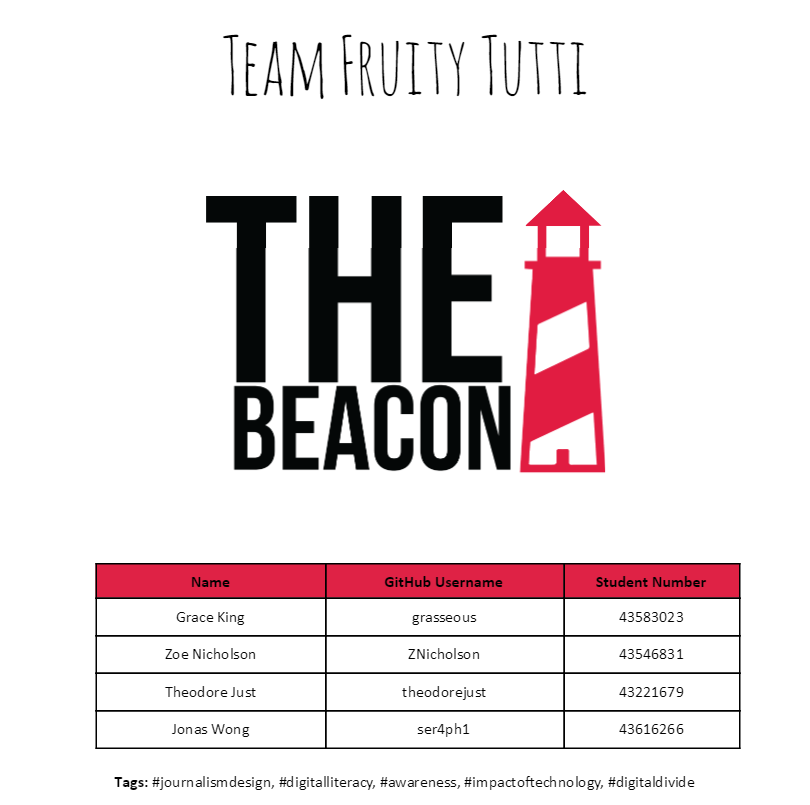
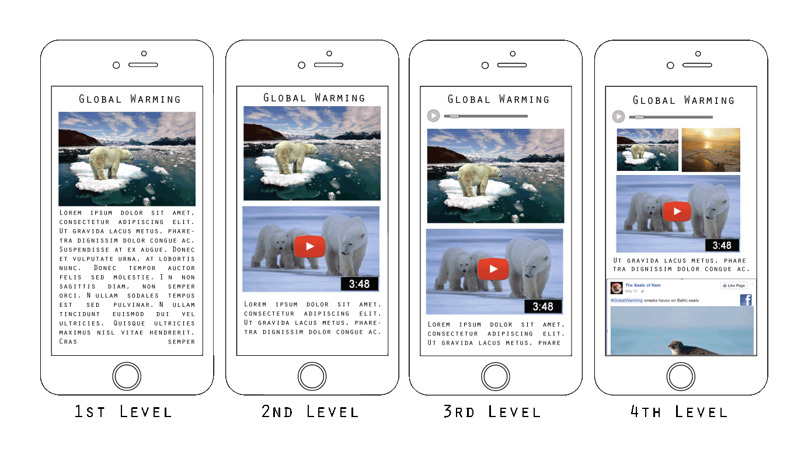

# Team-Fruity-Tutti

A Project by Team Fruity-Tutti

Project name: "The Beacon"

Team Fruity Tutti have chosen the project “The Beacon” to work on throughout the semester. The beacon aims to be a technological solution to the digital illiteracy of many citizens.  

THE PROBLEM
How do you deliver new stories to citizens with limited computing and internet skills and enable them to engage with these stories in a way that is simple to use, elegant, informative, doesn’t look or feel remedial and is no longer paper based?

TECHNICAL SOLUTION
The Beacon is a technological solution to the journalistic problem of not being able to provide news to all citizens due to their varied digital literacy levels. This application would assist these citizens to consume media in a safe and simple way. The application would have different levels of functionality. 

First level would show text and image based news stories. 
Second level would show text and image and video based news stories. 
Third level would show text and images, video and audio based new stories. 
Fourth level would show text and images, video, audio and social media based news stories. By having these different “levels” of functionality the application will be able to cater to a wider audience of users. 

News content will be specifically targeted towards the citizen. This would be based on previous articles the user had selected to view. The application would also use their GPS location, to gather local news stories that are directly relevant to the user. The Beacon will generate a profile of the user based on their usage, and then use these preferences to recommend new news stories. This more personalised approach would make it an enjoyable experience when reading, listening or watching the news.

FINANCIAL
A choice has been made to not include advertising in the application as a means of income, this is to limit any frustrations and the risk of getting “lost” while viewing content. Journalists would earn money based on the number of views per article. The application would earn money by charging a small monthly fee of $5 per month. It is estimated that to implement the application a start up cost of roughly $20,000 would be required to pay the programmers. The rest of the application costs would be funded by the government. 


CONCEPT
Approximately 80 per cent of Australians own a smartphone and thousands more own a tablet and other smart devices. Unfortunately, only 20 percent of senior Australians own a smartphone. Senior Australians often cite a lack of confidence and knowledge as one of the main reasons for not participating online (Liberal Party of Australia, 2016).

Just over a half of Australians aged 65 or over use the internet while the corresponding figure of those aged 15-17 is 98.6%. The big drop-off in use is between those aged 55-64 (81%) and those in the oldest age group (Theconversation.com, 2016).

The Beacon aims to target those suffering from digital illiteracy and isolation. Broadly, this includes senior citizens who haven’t been brought up under the prevalent use of digital products in our society. Additionally, the application aims to provide useful functions for those who dislike using technology or find it cumbersome to use.

PITCH FEEDBACK
During the 2nd of September practical session , We received the following feedback from our oral pitch: 

“Really like the idea of different modes of news, though a little unclear on the concept itself (sketches for the written proposal would be good). What’s the target audience? 65+ is a great target audience. Nice idea, I think be highly iterative and talk to the audience, find out the different modes of interaction.”

“The level system kind of confused me - I don't completely understand the point of them although the concept is interesting for sure. However, what makes this different from other news applications aside from the levels aspect?How will users switch between levels and why would they?”

“Nice concept and a good choice of target audience, just a little unclear on the purpose of the levels - are these supposed to be pages or sections or something else? How would this be easier for your target audience to understand? What is the difference between your news application and every other news application out there?”

“I like the intentions of the concept. I would like to further understand how the different levels help in this. Do the levels help readers by guiding users along with accessing the various media sources available on the subject? It might be helpful then to display the categories of the media separately on the article so users can choose what type of media they wish to view.”

TEAM
The Fruity Tutti team members are: 

Zoe Nicholson - Third year student studying  Commerce and Information Technology (BCom/BInfTech) majoring in Accounting. Skills : HTML/CSS, design and documentation.

Grace King - Third year Information Technology (BInfTech) student majoring in Information systems. Skills: HTML/ CSS, design, documentation

Jonas Wong - Third year Information Technology (BInfTech) student no major. Skills: python/java/design. 

Theodore Just - Third year Information Technology (BInfTech) student majoring in human-computer interaction and software information systems. Skills: C#, HTML/CSS, and Java.

Roles 
Team Leader	-	Zoe Nicholson
Design		-	Zoe, Grace
Front end	-	Jonas, Zoe, Grace
Back end	-	Theodore 
Content	-	All Team Members

The team leader, Zoe, will be responsible for logistics and organising meetings. All team members are expected to contribute to equally to the project and are expected to be self-motivated in selecting tasks to work on. As the team has a mix of technologically centered and design centered members , we are able to collaborate, mixing both design and technical aspects to ensure that the problem space is fully considered from both a design and technical perspective.

TASK DIVISION 
It is understood that different team members have different skill sets and therefore tasks will be divided with this in mind (team members will choose their task). If a team member feels they are unable to complete a task they have selected, they can raise it with the team leader or group and it will be given to someone who is better suited to the task. 

Poor performance on tasks will be addressed with the individual and if not resolved, it will follow the same process as conflict resolution below. 
Conflict Resolution
The team is self directed and will make major decisions as a group, disagreements will be settled through discussion or by the team leader if necessary. If issues arise between group members, they are expected to first address the problem with the team member they have an issue with. Once certain the issue cannot be resolved this way, they will escalate it to the team leader who will try to resolve it. If the members involved are still not happy, the issue will then be escalated to the DECO3500 team.

Repeated strikes of poor performance (not attending meetings, not submitting assigned work) will result in a penalty to the offenders grade.

COMMUNICATION
Team Communication: 

Meetings will be held every week in contact sessions (Friday, 10AM). If needed, additional meetings will be scheduled throughout the week when all team members are available to attend. Team communication will primarily be through the private Slack channel. This will be used to organise extra meetings, discuss tasks to be completed and any other relevant project-related matters. The whole team has access to the Slack channel and all team members are expected to check the Slack channel at least once a day for any updates. Slack was chosen as the whole team is familiar with it and everyone has an account. 

If a team member is unable to make it to a meeting or will be absent for a period of time, they are required to let the team know as soon as possible. 

The team will also use Zenhub as a collaborative tool to keep on track of what tasks are to be done and who is completing which task. All members have downloaded the Zenhub add-in and have access to the Zenhub board.
Prototype Management:
A designated Git repository has been created to be used as a collaboration repository to store the prototyping code. All team members have access to the repository.

A shared Google Drive folder has been created to store documentation for the project. All members have access to and can contribute to the Google Drive. The documentation in the Google Drive will be used as a collaborative tool for ideas, and drafts of project documentation. We chose Google Drive as all team members are familiar with it and it is the easiest collaboration tool for written documentation.

All team members are expected to refer to the Zenhub board, which will act as the single source of truth if they are unsure of which tasks they are required to complete. If a team member is unable meet a deadline for a task, they should notify the team at least 24 hours beforehand. The team can then help distribute aspects of the task so that it is completed on time. 

OUR COLLABORATION TOOLS:
GitHub: https://github.com/deco3500/Team-Fruity-Tutti
ZenHub: https://github.com/deco3500/Team-Fruity-Tutti/issues#boards?repos=66042754

PLAN
Team Fruity Tutti aims to have three phases throughout the development process of The Beacon in order to flesh out the project completely. In order, these are the Research/Requirements, Design and Construction phases. Each phase outlined below will include the key deliverables and resources we will need to complete the phase. Throughout each phase, the team will continue to iterate and test to ensure that the concept evolves as much as possible. 

Research & requirements phase: Weeks 7 - 8
By the end of this phase we should have a set of personas to help us understand digital illiteracy and who the target user group is. We also aim to have an understanding of the technological hurdles we will have to overcome to create our application. The team will also explore Conversation, Coordination, Collaboration and Awareness to understand how The Beacon can support these concepts.  During this phase we will define the requirements of the application on a technological and design level. Conducting user research will also help ensure that we know exactly what the user needs and who we are building for so that we can cater directly to the target group. In order to conduct the research, we will conduct interviews and surveys with participants from the target group. We will also use a lean canvas scaffold to ensure that the whole project has been fleshed out.                     

Milestone: Feedback Session 1 in week 8

Key Deliverables: 
Understand target use group demographic (produce 1-2 personas of the envisioned user)
Explore how we can use the concepts of Conversation, Coordination, Collaboration and Awareness 
User research has been conducted and survey/ interview results are analysed
Lean canvas is produced that documents the problem, solution, key metrics, costs etc.

Design phase: Weeks 9 - 10
This phase will be dedicated to designing the framework of the application, such as creating a basic code framework to which we can add features. We will also ensure that we have fleshed out each level of literacy for the app so we know exactly what we will include in each level (e.g different levels of image and text).  We will also create several visual prototypes of how the application will look. These will include mockups that define exactly how each level of The Beacon will work. The mockups will be user tested so that we can iterate and improve the prototype for the construction phase.

Milestone: Feedback session 2 in week 10

Key Deliverables:
Basic HTML/ CSS framework is deployed on the zone.
Report documenting exactly what each level entails produced.
Mockups for each level are produced using mockup apps such as Marvel.
Mockups tested and survey results are analysed to improve the prototype.

Construction phase: Weeks 11 - 13
The web prototype is built upon until near completion and content is generated/found to put into the prototype. The final prototype will be highly advanced. User testing will be completed on the prototype so that the finished product is the best possible version. Feedback received is implemented.

Milestone: Feedback session 3 in week 12

Key Deliverables:
Fully developed web prototype deployed on zone
User testing completed and feedback implemented


BIBLIOGRAPHY

Liberal Party of Australia. (2016). Improving the digital confidence and skills of senior Australians. [online] Available at: https://www.liberal.org.au/latest-news/2016/06/26/improving-digital-confidence-and-skills-senior-australians [Accessed 4 Sep. 2016].

Theconversation.com. (2016). [online] Available at: http://theconversation.com/australias-digital-divide-is-narrowing-but-getting-deeper-55232 [Accessed 4 Sep. 2016].

